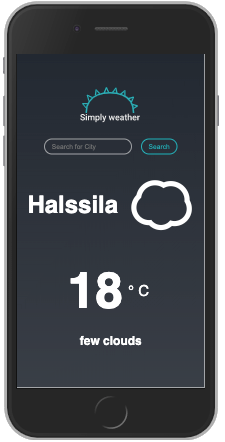

# SimplyWeather
Simple weather application that shows current weather anywhere in the world.
Made with only html, css and vanilla javascript.  


Practised working with an API and API documentation. 

## Important note
This application uses OpenWeatherMap API for getting the weather data.
In order to make the application work you need to create your own API KEY on https://openweathermap.org/api
and create a config.js file where you will add your new API key.  
```
 const config = {  
  API_KEY: "YOUR_API_KEY"  
 }
 ```
